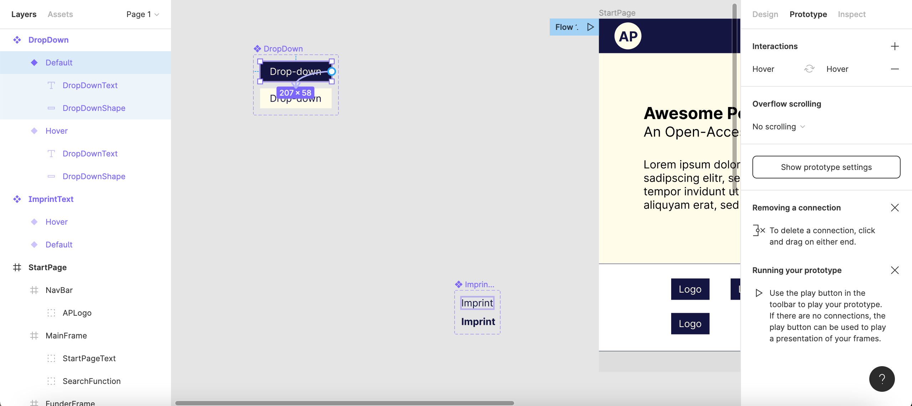
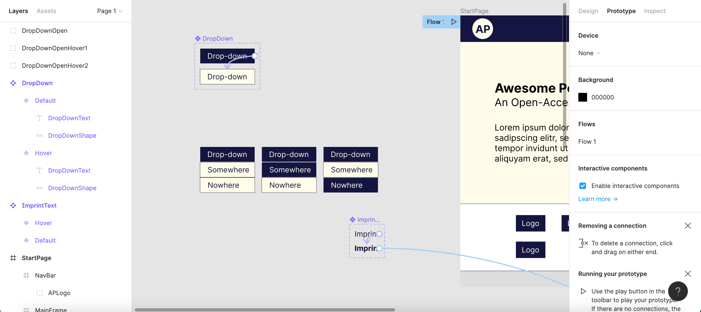
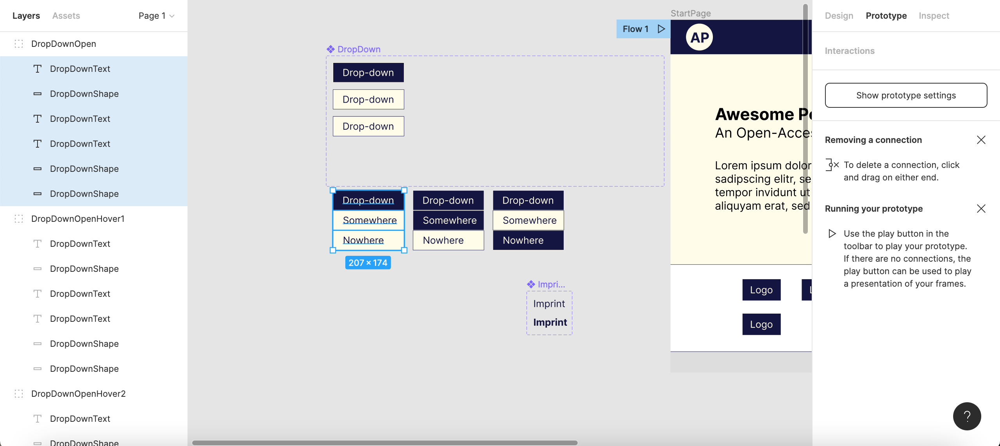
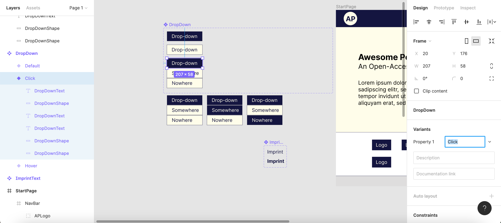
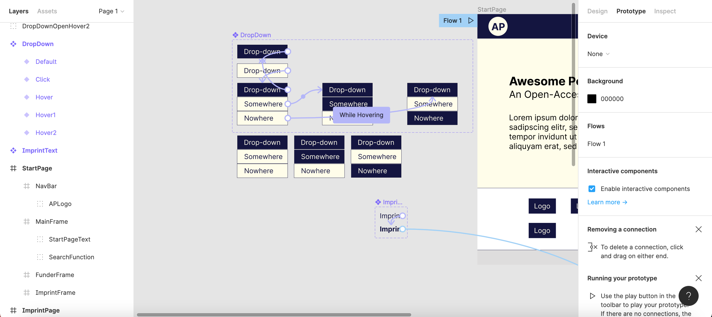
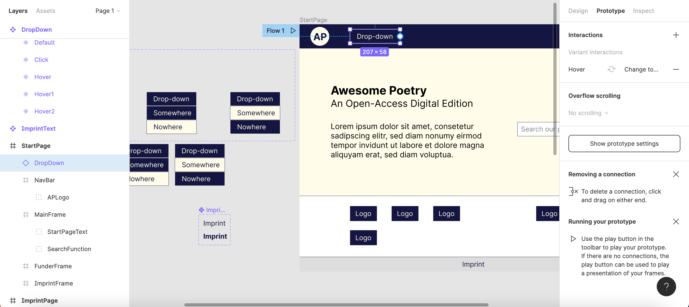
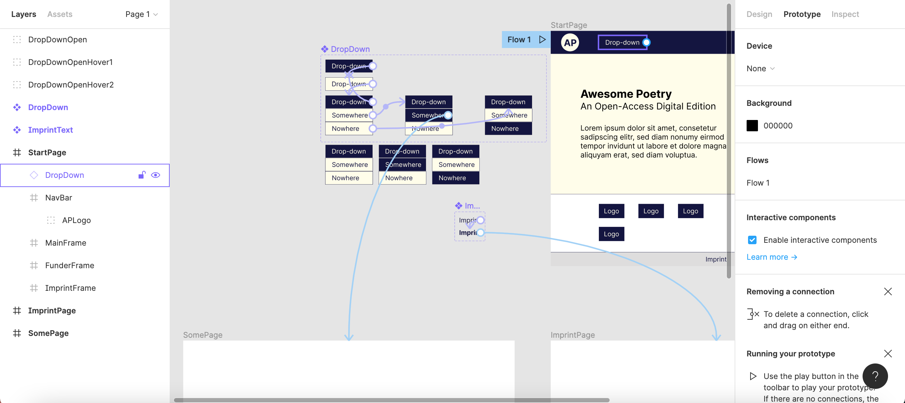
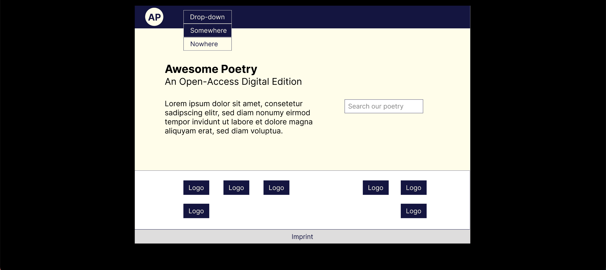

# HowTo Figma [^1]

Target group: readers interested in (collaborative) UI (unser interface, website) design, with or without prior knowledge in UI design

Contents: introducing Figma as a tool for UI design, exemplified by designing - step by step - a simple UI for a (fictional) digital-edition project

Aims: readers can use Figma to (collaboratively) design and prototype UIs
- readers can sign up to Figma and create teams
- readers can create mock-ups in Figma
- readers can prototype interactive functionality in Figma including links and simple dropdown lists

## Introduction

Figma is a tool for collaborative UI design. It can be used for interface mock-up (realistic visual design) and prototyping (realistic visual design plus simulation of interface functionalitites). Mock-up and prototyping will usually not be the first steps in interface design: they will usually be preceded by other steps such as expert interviews, brainstorming, or use case modeling. Most especially, mock-up and prototyping are typically preceded by [wireframing](https://en.wikipedia.org/wiki/Website_wireframe).

## First Steps

### Sign up

Figma can be used through a [web-based application](https://www.figma.com/). There are different pricing options including a free `Starter` plan with limited numbers of files as well as `Professional` (free for students and educators) and `Organization` plans (March 2022).

### Create a Team

Create a team to collaborate. Right at the start, Figma will ask you to name your team and to invite your collaborators. For trying Figma, choose the `Starter` team plan. (You can work in Figma individually as well. If you want to skip creating a team for now, you can later select `+ Create new team` in the bottom-left part of the start screen). In the example project, the team's name is "Awesome Poetry" and consists of two members.

## Mock-up

### Create a Design File

Create a design file by clicking `New design file`, or by clicking the `+` icon that will appear next to `Team project` when you hover over it and selecting `Design file`. This will open the workspace screen.

The first step is to create a frame that represents the start page of your future website. When you click on the `Frame` icon (the third icon from left in the top navigation bar of the workspace screen, part of the `Region tools` dropdown list), the bar on the right-hand side will offer predefined sizes of frames that correspond to different devices for accessing your website. For our digital edition of awesome poetry, select `Desktop` size (1440 x 1024 px). In the left-hand `Layers` area, double-click the name of the frame ("Desktop - 1") to rename it "StartPage". **It is always good to give telling names to your objects in order not to get confused - there will soon be a lot of them.**

### Create Sub-Frames

We can now start adding sub-frames within the "StartPage" top-frame to define large areas within the page. Let's first create a navigation bar: select `Frame` and draw an oblong shape in the top part of the page. In the `Layers` area, rename it "NavBar". The width and height are displayed in the right-hand `Design` area of the workspace screen (and next to the frame whenever selected). Further below, in the `Fill` segment of the `Design` area, you can pick a color. In the example, a dark blue has been chosen. As this color will be used as one of the edition UI's signature colors, it can be saved: next to `Fill`, click on the four-dot icon which the tooltip identifies as the `Styles` button. Then, select `+` and name the color style, say, "EditionBlue". Now, you can easily come back to that color when you need it.

Add three more frames: a large frame below the "NavBar" as the "MainFrame" of the "StartPage"; a smaller "FunderFrame" below that; and, finally, a slim "ImprintFrame". Fill the "MainFrame" with an off-white color and save that color as "EditionWhite". Give the "FunderFrame" a thin border: in the `Stroke` segment of the right-hand `Design` area, click the four-dot icon and select the "EditionBlue" hue to apply the color style that has been saved before; set the line width to "1". Leave the "FunderFrame" white and make the "ImprintFrame" gray. In the left-hand `Layers` navigation, arrange the frames according to their position on the page. **Frames and objects that are placed in a high position in the `Layers` area are displayed on top of other frames and objects in the page mock-up in the central window of the workspace screen.**

### Populate Frames with Objects

You can now start adding objects to the frames. In the `Shape tools` dropdown list (the fourth drop-down button from left in the top navigation bar of the workspace screen), pick `Ellipse` and, in the blue navigation bar of your own page, draw a circle as a logo placeholder. Color it in "EditionWhite" and rename it "APLogoShape". Add some text onto it (such as "AP") by selecting the `Text` icon (the sixth button from left in top navigation bar of the workspace). You can style that text (font, size, style) via the `Text` section of the right-hand `Design` area: select the "EditionBlue" hue by clicking the four-dot icon next to `Fill`. Rename the text object "APLogoText".

Furthermore, add a rectangular shape as well as some text to represent a drop-down button in the "NavBar" of your "StartPage". Style and rename as "DropDownShape" and "DropDownText", respectively.

Add three text objects to your "MainFrame": a title, a subtitle, and some placeholder text, representing an introduction to your edition website. Also, add a rectangle and a text to stand for a search field. In the "FunderFrame", add a shape and text to represent some funder's logo. Moreover, add a text, representing a link, to your "ImprintFrame". Style those objects and rename them in useful ways. (Re-)arrange their order in the left-hand `Layers` bar - especially, when one object gets hidden behind another and is no longer visible.

### Group Objects Together

It is useful to group together objects that belong together: for example, objects which, together, constitute a more complex single object. In the `Layers` area, select both "APLogoText" and "APLogoShape", right-click them, and select `Group selection`. Groups are symbolized in the `Layers`area through dashed-line rectangles: rename the created group "APLogo". Likewise, create "DropDown", "StartPageText", "SearchFunction", and "Logo" groups. When you select those group names in the `Layers` area, you can target the whole complex objects (instead of just their parts). (For the sake of clarity, you might wish to collapse the layers in the `Layers` area which are below the group level.)

### Create Components

If there are objects, either simple or complex (groups), that are used more than once, you can create components out of them which can be easily reused. In the `Layers` area, right-click the "Logo" group and select `Create component`. (You can also click the `Create component` icon in the middle of the top bar of the workspace screen.) As a component, it is now highlighted in purple color. Change the view in the right-hand window from `Layers` to `Assets`. In that area, you will now find the "Logo" component in the "StartPage" segment. From here, you can drag-and-drop that component multiple times onto the "FunderFrame" to represent several funder logos. Please note, that if you change the original component (designated by a four-diamond icon in the `Layers` area), all its instances (single-diamond icons) will be changed in like fashion - that is one of the key benefits of using components. On the other hand, if a component's instance is changed, the other instances as well as the original component will remain unaltered. 

You have now created a simple mock-up for the start page of a digital-edition UI. At this point, you might well wish to see your page in presentation mode (rather than work mode). For that, click the `Present` button (second button from right in the workspace navigation bar). A new tab will open in your browser while the work mode will remain active in the original tab. In the `Options` dropdown list, select `Fit to screen` to see your "StartPage" in its entirety.

## Prototyping

By means of adding even more objects, groups, and components (to represent, for instance, images as well as further buttons and input fields), you can create visually realistic mock-ups of website pages. However, Figma lets you also prototype interface functionality by simulating user interactivity and navigation between pages as well as within different areas of the same page.

### An Easy Example: Create a Link to Another Page

Suppose that the "ImprintText" object on the bottom of your "StartPage" is meant to represent a link to another page containing information about the website's publisher. So, let's first build another page. Create a second desktop frame as you did above. It might be useful now to zoom out of the central window of the Figma workspace screen so that you can see both pages. Rename the new page from "Desktop - 1" to "ImprintPage". While we leave that new page blank, you will usually want to design it in a way that is similar to your "StartPage". (Among other things, you might want to create a "NavBar" component and add it to the top of all of your pages.)

Turn the "ImprintText" object into a component (as was done above). Subsequently, drag-and-drop it from the "StartPage" frame into the gray area that surrounds it. That way, we can separate the orignal component from its instances to edit it. In the `Layers` bar, the "ImprintText" component will, therefore, no longer be shown within the "StartPage" hierarchy, but on the same level as both the "StartPage" and the "ImprintPage".

We can now create two different variants of our "ImprintText" component that correspond to two different types of user interaction:
1. "Default": when there is no user interaction,
2. "Hover": when a user's cursor hovers above the "ImprintText".

Keep the "ImprintText" component selected. In the right-hand `Design` area, click `Variants`. Our component has now automatically been duplicated. The lower twin of the component should be highlighted (if not, select it); in the `Variants` section, enter "Hover" (replacing "Variant2") to designate `Property 1`. (When you highlight the upper variant of our component, its name should be "Default". Leave it like that.)

Now, we can design what it should look like when a cursor hovers over the "ImprintText". Twice double-click into the text and style it bold. You could also change the text color or add a drop shadow in the `Effects` segment.

The next step is to define the interaction that triggers the "Hover" variant. To that end, select the (upper) "Default" variant. In the top of the right-hand control area, switch from the `Design` to the `Prototype` tab. Next to `Interactions`, click the `+`. In the `Interaction details` window that now pops up, choose `While hovering` - `Change to` - "Hover". Close the window. As long as the `Prototype` tab is active, the "Default" variant is now visually connected to the "Hover" variant through a purple arrow, indicating that the former will change to the latter when an event (a hover event, in our case) takes place.

However, we also want the "ImprintText" component to link to the "ImprintPage" when clicked. For this, highlight the lower, "Hover" variant of the "ImprintText" component. In the `Prototype` section, click `+` and then select `On click` - `Navigate to` - "ImprintPage". A blue arrow now depicts the linking to the "ImprintPage".

The "ImprintText" component is now fully configured, and an instance of it can be implemented in the design of our "StartPage". From the left-hand `Assets` area, beneath `Local components`, drag-and-drop the component to the "ImprintFrame" of our "StartPage". Switch to `Present` mode and try out the hover event and linking.

### A More Complex Example: Create a Dropdown List

There is an empty dropdown button in our "NavBar", which we can now prototype as well. Proceed as before: create a component out of the "DropDown" group, and drag-and-drop it into the gray area outside your pages. Create a "Hover" variant, which you can style by inverting its colors ("EditionBlue" text and border colors, "EditionWhite" fill color). Add an interaction that is triggered by a `Hover` event.

We now have to design three states of the dropdown list to represent three different types of user interaction once they have clicked the dropdown button:
1. "Click": when a user clicks on the button (the dropdown list opens, the button has an "EditionBlue" fill color, the two options have an "EditionWhite" fill color),
2. "Hover1: when a user's cursor hovers over the first option of the open dropdown list (the button and the first option are blue, the second option is white),
3. "Hover2": when a user's cursor hovers over the second option (the button and the second option are blue, the first option is white).

In the gray area of the central window, somewhere below the "DropDown" variant, design those three states. For this, you can copy-paste the "DropDownText" and "DropDownShape" objects from the "DropDown" component in the `Layers` area and combine them to design the three versions described above. All of these versions should have three segments: a button ("Drop-down") and two fields representing links to other pages ("Somewhere" and "Nowhere"). Group the objects that belong together and rename the groups "DropDownOpen", "DropDownOpenHover1", and "DropDownOpenHover2".

Now, the groups representing the three different states of the opened dropdown list can be used as different variants of the "DropDown" component. So, select the "Hover" variant of the "DropDown" component and click on the `+`; rename "Variant3" to "Click". Enlarge the purple dash-line rectable that delimits the component variants. In the left-hand `Layers` area, select and copy all objects of the "DropDownOpen" group.

In the main windown, highlight the "Click" variant and paste the objects from the clipboard (a shortcut will work out best, so use `Ctrl`+`v` in Windows or `command`+`v` on a Mac). The copied objects will now be shown in the `Layers` area to form part of the "Click" variant. (Here, you might see the "DropDownText" and "DropDownShape" of the original variant that has been overwritten are still around as part of the "Click" variant; you can safely delete them.)

In the `Prototype` area, create an interaction that links the "Hover" variant to the "Click" variant (`On click` - `Change to` - "Click").

Now, create two more variants, overwrite them with the two other groups designed below, and rename them "Hover1" and "Hover2", respectively. In the `Prototype` area, prototype the following user interactions:
- when a user clicks on the "Drop-down" button of the "Click" variant, change back to the "Default" variant (`On click` - `Change to` - "Default"),
- when a user's cursor hovers over the "Somewhere" field of the "Click" variant, change to the "Hover1" variant (`While hovering` - `Change to` - "Hover1"),
- when a user's cursor hovers over the "Nowhere" field of the "Click" variant, change to "Hover2" (`While hovering` - `Change to` - "Hover2").

Furthermore, create another page ("SomePage") and make Figma navigate to it when a user clicks on the "Somewhere" field of the "Hover1" variant (`On click`- `Navigate to` - "SomePage").

The "DropDown" component is now fully configured. From the `Assets` area, drag-and-drop it to the "NavBar" of your "StartPage". It is necessary, however, to move its instance, in the `Layers` view, from the "NavBar" sub-frame up to the "StartPage" top-frame (as its appearance will otherwise be limited to the space of the "NavBar" sub-frame).

As long as the `Prototype` view is active, you will see a fairly complex network of interrelations between component variants as well as links between variants and pages.

In the presentation mode, try out the user interactivity added to your website prototype.

## Outlook

At this point, it may have become easy to see how a UI prototype could easily be further enriched by adding components whose variants and the interrelations created between them can add to realistically simulating interactive functionality. It should be noted that there are many more functions beyond those which have been introduced above (such as using Figma's `Constraints` function to make your pages responsive, or exporting CSS code from Figma). There is much community-driven support (both text and video) online that will help you to explore the full potentials of Figma and solve specific problems that you might encounter. [Figma's Support Forum](https://forum.figma.com/) might be a good starting point for getting help and interacting with community members. You will also find a large number of public plugins for standard functionalities (such as dropdown menus).

Find the Figma design file used as an example in the above introduction [here](https://www.figma.com/file/XQVUuaMIQqOkVWp5Z0yLXi/Untitled).

[^1]: Based on contents provided by Fabian Etling (CeDiS, Freie Universität Berlin) at ide 2022 Winter School *Digitale Editionen - Interface-Design*, University of Wuppertal, 21-25 Mar 2022.